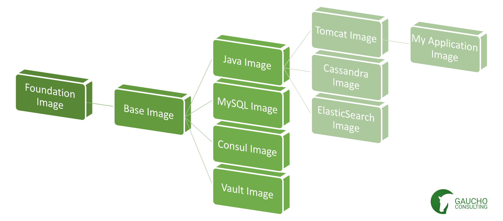

# Machine Image Catalog

Write some Blah, blah...



Building the Foundation Image

To build the Foundation Image execute the following command from the root of the repository:

```
ROOT_PASSWORD="$(openssl rand -base64 32)" BOOTLOADER_PASSWORD="$(openssl rand -base64 32)" packer build -var-file boxes/foundation/variables.json boxes/foundation/packer.json
```
